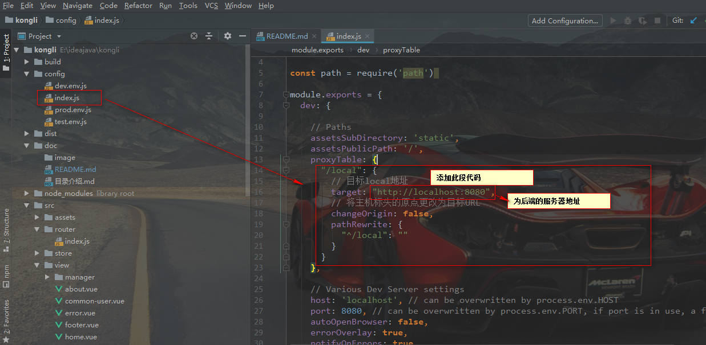
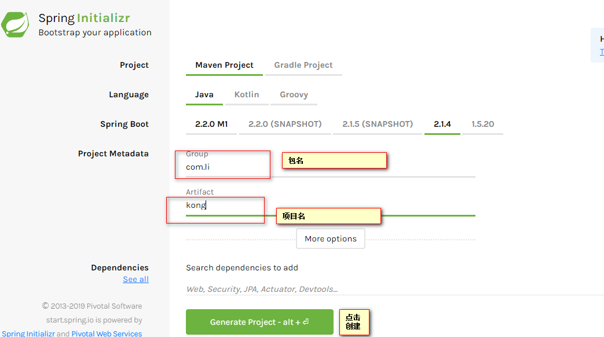
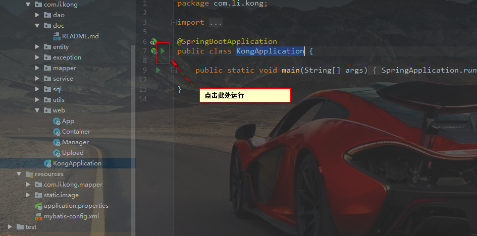
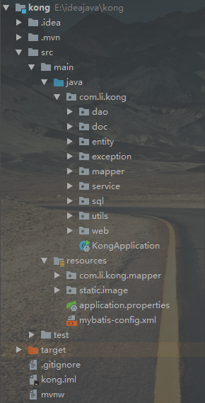
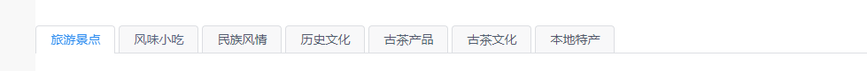

### 使用的知识点

>1. 使用element UI做前端UI界面
>2. 使用spring boot做后台框架
>3. 前端使用vue.js，后端使用Java
>4. 前端使用到的只是有javaScript、HTML、sass、vuejs、vue-cli。后端使用到的语言Java、sql,使用到的
框架有spring boot、mybatis。

### 前后端分离开发

* 传统的web开发模式，后端一定程度上依赖与前端页面的开发，而前端一定程度的依赖后端的数据接口的开发。
整个开发过程中部分阶段处于串行状态。就是前端和后端处于同一项目下。而前后端分离的核心思路就是打破这种串行，
使得前端与后端能够并行开发，将前端和后端分离，是前端单独使用一个项目目录，并基于nodejs开启一个服务，开发时可以单独运行。
后端将前端分离出来，不依赖于前端界面，只要编写好前端请求接口就可以，无需前端页面。前端与后端通过接口进行交互，其他代码
互不干预。前端页面数据获取是前端发送一个请求到后端，后端返回数据，前端接收到数据后对数据进行渲染，显示在页面上。
* 此项目中异步请求数据通过axios向后后端发送请求。如向后端发送一个请求,获取所有的实时资讯
```javascript
        this.$axios.post('/local/manager/findAllInfo').then(function (response) {
          self.info = response.data
          self.infoLength = response.data.length
        }).catch(function (error) {
          self.$Message.error('服务器异常')
        });
```
以上代码中“/local/manager/findAllInfo”是请求后端的接口，response是后端返回的数据。后端在kong项目中web文件下的Manager.java
中有此段代码
```
     /**
     * 获取所有的实时资讯
     *
     * @return
     */
    public @RequestMapping("findAllInfo")
    List<Information> findAllInfo() {
        List<Information> list;
        try {
            list = infoService.findAll();
            return list;
        } catch (Exception e) {
            return null;
        }
    }

```
此段代码就是后端从数据库中获取所有的实时资讯,此时前后端接口已经打通。

### 前端项目

* 前端项目是使用vue-cli脚手架，创建前端项目

>1. 创建一个vue项目需要nodejs，首先安装nodejs.
>2. 安装vue-cli脚手架 npm install -g vue-cli
>3. 选定一个目录，使用cmd输入指令 vue init webpack kongli,一路回车下载vue-cli脚手架，等待完成下载就创建好kongli项目。
>4. 最后在kongli目录下使用cmd调出命令窗口，下载依赖包npm i 。然后输入 npm run dev 就可以运行项目

* 前后分离开发需要解决vue-cli跨域问题如下：



* 此项目使用到了element ui组件库。
>1. 安装element ui 依赖包 npm i element-ui -S
>2. 在main.js文件中全局引入，然后就可以在项目中使用element ui组件库
```javascript
  import ElementUI from 'element-ui'
  import 'element-ui/lib/theme-chalk/index.css'
  Vue.use(ElementUI)
```

### 后端项目
* 后端项目使用了spring boot 和 mybatis框架，spring boot主要是用来控制前端发送请求的，接收前端的数据，并返回
给前端。mybatis框架主要是数据层，用来操作数据库，对数据库进行操作。如连接数据库和数据库的曾改删除。
* 项目使用spring boot的快捷创建项目方法

进入此网站https://start.spring.io/创建spring boot项目
. 创建项目如图


使用idea打开下载好的文件，然后idea编辑器自动下载下载依赖jar包，打开KongApplication文件，点击右边的绿色进行运行
一个spring boot 项目就运行起来了


* 后端使用到了三层架构模式，分别是数据访问层，业务逻辑层，表示层。数据访问层主要数用来连接数据库和操作数据库。
使用了mybatis框架连接数据库和操作数据库，对数据进行曾改删查。在项目中dao包表示数据访问层。业务逻辑层主要处理业务
逻辑的代码，如用户保存时对密码加密，发表评论添加时间等逻辑处理，项目中service包表示业务逻辑。表示层是与页面交互，
主要接收页面传递的数据和返回数据到页面，此项目中相当于接口处理。对页面发送过来的数据进行处理，并与业务逻辑层进行交互。
将处理好的数据返回到前端页面。三层架构之间的关系是表示层负责与页面交互并调用业务逻辑层的方法进行处理，业务逻辑层与数据连接处
交互，将处理好的数据调用数据连接层的方法对数据库进行操作。因此三层之间的关系是表示层与业务逻辑层有连接，业务逻辑层与数据访问层
连接，表示层与数据访问层互不干涉。

* 项目主要目录



其中Java文件下是主要实现代码包com.li.kong为Java实现代码。KongApplication文件是启动spring boot
项目文件。dao包为数据访问层，操作数据库的Java代码。doc为说明文档包。entity是实体类包，创建JavaBeen.
exception是自定义异常类，有DataAccessException、DaoException、ServiceException分别是抛出数据库操作
异常，dao层异常和service异常。mapper是mybatis框架操作数据的接口。与mybatis配置文件相对应，并在dao中进行调用。
service包存储业务逻辑层的代码。sql包是创建数据库文件。utils是抽出来的工具包，如字符串处理。web包为表示层代码，
负责编写与前端交互的接口。resources为资源文件其中com.li.kong.mapper为mybatis配置包，存储数据库表对应的配置文件
对数据库进行操作，与Java文件下的mapper包下的接口对应。static.image存储图片文件。application.propertis
文件是spring boot配置文件，配置发送邮箱名，密码和服务器等。mybatis-config.xml文件时mybatis框架配置连接数据库文件。
其他文件为spring boot项目框架自带的文件。
### 实现思想

#### 登录实现思想

* 首先前端页面进行数据填写，使用element ui 的form表单对数据进行检查是否为空或填写是否正确。获取填写的数据
用户名和密码，点击登录按钮时触发一个点击事件，把用户名和密码发送到后台，后台通过用户名（邮箱）查询是否存在，
如果存在就对比用户密码，密码需要使用md5加密后才能与数据库中查询出来的密码进行比较。如果密码正确返回登录成功和用户信息。
并将用户信息保存到session中。如果用户名不存在或密码比较错误，则返回状态码-1,表示登录失败。并且用户提示
登录的错误信息。登录后根据用户的角色的不同给角色一个权限，如管理员登录在个人中心可以管理后台数据，普通会员只能查看个人信息、
修改个人信息和修改密码。

#### 注册实现思想

* 注册前端使用element ui中的form实现对数据的校验，检查某些数据是否为空，邮箱格式是否符合。密码和确认密码是否相等，如果
数据校验不通过就不能注册。点击获取验证码时需要查看邮箱是否输入，如果符合规定就发送一个请求到后台，使用(int)(Math.random()*1000000)
生成六位随机数字，使用spring boot自带的SimpleMailMessage类给所填入的邮箱发送验证码邮件，并将邮件保存到session中，返回
“邮件发送成功提示”，点击注册时将页面所填入的信息发送到后台，首先对邮箱进行检测，使用邮箱对数据库进行查询，如果存在就返回用户已被注册
提示，如果用户不存在就从session中取出验证码进行校验对标，验证码正确就执行数据库保存数据操作，在保存呢数据库之前需要使用md5
对密码进行加密再存入数据。保存数据成功后将保存数据成功信息返回给前端页面，提示用户“注册成功”并跳转登录页面。

#### 普安页面实现

* 关于普安页面的导航栏是使用element ui的Tabs 标签页标签页实现，将数据库中所有的分类查询出来将数据显示到导航栏中，实现动态显示



对于主要内容是根据类型对数据库进行查询，然后显示到页面。点击相应的内容后到详情页面，将查到的数据通过路由传参
将数据传递到详情页面，对不同的内容进行显示。对于评论需要判断是否登录，使用v-if进行判断是否登录，如果登录就显示
编辑框并可以发表评论，点击发表评论后将数据传到后台进行保存，后台保存完成后需要评论更新就需要重新查询评论
根据文章id查询此文章的所有评论并返回页面，将新查询出来的数据进行渲染。使用用户登录邮箱和评论邮箱进行比较，如果
邮箱相等则可以对评论进行删除操作。或用户的角色是管理员可以对所有评论进行删除操作。

* 分页是使用前端分页，将所有的数据查询出来后使用element ui分页组件实现。在循环数组时使用
data.slice((currentPage-1)*pageSize,currentPage*pageSize)对数组进行截断，达到实现分页效果。
分页组件代码
```
      <el-pagination background :current-page.sync="currentPage" :page-size="pageSize" layout="total, prev, pager, next,jumper"
                     :total="notes.length">
      </el-pagination>
```

#### 个人中心

* 当使用使用普通会员登录时只有查看个人信息，修改个人信息，修改密码功能。修改信息是将会员信息回显到输入框
中，用户邮箱，和角色是不能改变所以使用disabled禁止输入数据，只允许读。点击修改后将会员信息传到后台，调用
修改会员的方法，执行update语句对会员信息进行修改。

* 修改个人密码。填入旧密码，新密码和确认密码需要发送验证码进行验证是否为本人，前端只需要检查新密码和确认密码
是否相同即可。后端需呀先查询出用户信息，拿到旧密码。新密码需要使用md5进行加密后和从数据库中查询的密码进行比较
如果旧密码和新密码加密后的相等，就比较验证是否相等，都通过验证就调用update修改数据库数据。否则返回错误信息提示。

##### 管理员登陆
* 使用管理员账号登录比普通会员多一个后台系统管理功能。管理员管理会员时，只能对会员进行封号操作，且管理员不能对其他管理员
进行任何操作，只能看到其他管理员信息。实现思想是判断是用户是否为管理员，是就给出提示，不是管理员就进行操作。修改用户信息
将t_user表中的forbidden值从“N”变为“Y”，表示冻结会员，此会员就不能登录。

#### 添加文章

* 添加文章没有使用到form表单，只是使用到输入框和下拉框。实现思想是获取文章标题、类型、图片名称和文章内容。通过axios异步
请求，将数据发送到后台。
* 对与类型的选择是先从数据库中查询所有的类型。默认选择第一个类型，将查询出来的数据放到下拉选择框中，实现下拉选择的类型。
图片时使用存储图片路径，先将图片放到服务器的文件下面，输入文件名称，将名称存储到数据库中，必须保证输入的图片名称在服务器
文件下存在相应的图片否则图片找不到。
* 编辑文章内容使用的是quill-editor编辑器，文章中可以插入图片，图片保存是base64格式，在页面显示时将base64解码为图片格式。
* 点击保存时只能保存一次，因为数据库中没有使用唯一标识给标题限制，所以点击多次后可能保存为多份。在前端添加一个限制不能保存
多次，使用一个变量 isSave 来判断是否已经保存过，如果没有保存变量值为false，可以点击保存，点击后将变量值变为true。当值为
true后，点击保存按钮就直接跳出方法，不再继续往下执行，并弹出提示。
* 在后端保存时，先保存文章，将文章的id、标题、内容、是否点赞和反对保存到数据库中。其中id是使用UUID生成一个32位唯一的字符串，
为了方便保存图片和评论，点赞和反对默认赋值为0。在保存好文章后需要将图片名称也保存到数据库，图片是外键note_id是文章的id,获取到文章的id将其赋给
图片的对象再将数据保存到数据库中。

#### 文章管理

* 文章管理功能只有删除和修改两个功能。删除文章是根据文章的id删除文章，获取文章id后发送请求到后台。后台Java根据文章id先把
图片数据和所有的文张评论删除后再删除文章。如果不删除文章评论或图片，执行删除文章操作会失败。
* 修改文章，点击修改时通过路由传值是方法将此文章的所有数据传到修改页面，将相应的数据显示到对应的位置。然后根据保存的原理
对文章进行操作，只是后台执行的时候执行的事update操作。前端请求的接口与保存文章的接口不同。修改内容可以重复点击修改操作。


